# Pull Request を通じた貢献に関して役立つ情報
Pull Request を通じた貢献に興味をお持ちいただき、誠にありがとうございます。

少しでも興味を持っていただけた方に、このプロジェクトに対する貢献をしていただくうえで役に立つ情報を掲載します。

参考にしていただき、貢献頂ければ大変助かります。よろしくお願いいたします。

- [Pull Request を通じた貢献に関して役立つ情報](#pull-request-を通じた貢献に関して役立つ情報)
  - [貢献に関してのお願い](#貢献に関してのお願い)
    - [作業に関する報告について](#作業に関する報告について)
    - [作業を送信いただく際のお願い](#作業を送信いただく際のお願い)
    - [`/locales` フォルダに関して](#locales-フォルダに関して)
    - [ドキュメントの編集について](#ドキュメントの編集について)
  - [コード変更のガイド](#コード変更のガイド)
    - [1. プロジェクトの全体像：設計思想](#1-プロジェクトの全体像設計思想)
      - [３つの主要な柱](#３つの主要な柱)
    - [2. ディレクトリ構造の歩き方](#2-ディレクトリ構造の歩き方)
    - [3. 主要な処理の流れ](#3-主要な処理の流れ)
      - [A. コマンドが実行されるまで](#a-コマンドが実行されるまで)
    - [B. 音声が再生されるまで](#b-音声が再生されるまで)
    - [4. このプロジェクトを特徴づける重要な設計](#4-このプロジェクトを特徴づける重要な設計)
      - [① Strategyパターンによる堅牢性](#-strategyパターンによる堅牢性)
      - [② 音源ソースの抽象化](#-音源ソースの抽象化)
      - [③ イベント駆動による疎結合](#-イベント駆動による疎結合)
    - [5. 貢献へのステップ](#5-貢献へのステップ)
      - [A. 新しいコマンドを追加するには？](#a-新しいコマンドを追加するには)
      - [B. バグを修正するには？](#b-バグを修正するには)
  - [モジュールの継承関係について](#モジュールの継承関係について)
  - [モジュールの依存関係について](#モジュールの依存関係について)
  - [最後に](#最後に)

## 貢献に関してのお願い
### 作業に関する報告について
- 機能追加やバグ修正など、コード変更を行う際は、できる限り Discord サーバーでその旨のメッセージを送信いただくか、GitHubで Issue を開いてください。
  - 誰が何の作業をしているのか明確にすることで、重複した作業をしてしまうおそれを回避することができます。
  - ただ、絶対的なルールではないので、ご報告がなかったとしても大丈夫です。
### 作業を送信いただく際のお願い
- コミットメッセージは、あまり気にしなくて構いません。
  - こちらで適宜変更したうえでマージしますので、適当で構いません。
  - Pull Request のタイトルは、日本語でも構いませんので内容が分かるように書いてください。
- Pull request を開く際は必ず`master`ブランチ、または`v1`、`v2`、`v3`などのブランチを対象に行ってください。
  - このルールに従っていただいたとしても、サポート対象外のブランチにPull requestを送信いただいた場合には、マージされない場合がございます。
- Pull requestを送信いただく前に`npm run lint -- --fix`を行っていただき、エラーがない状態にしていただくことをお勧めします。
  - よくわからなければ、そのまま Pull Request を送っていただいても構いませんが、マージが遅れる可能性があります。
### `/locales` フォルダに関して
- [`/locales`](../locales/)に保管されているファイルは、[Crowdin](https://crowdin.com/project/discord-simplemusicbot) にて一括管理されているため、Pull Request ではなく [Crowdin](https://crowdin.com/project/discord-simplemusicbot) で編集してください。
  - ただし、[`/locales/ja`](../locales/ja/)にある、日本語のファイルに関しては、Pull Request 経由で大丈夫です。
  - よくわからなければ、`/locales`を編集して Pull Request を送っていただいても構いませんが、反映が遅れる可能性があります。
### ドキュメントの編集について
- ドキュメントサイトのプロジェクトは[`/docs`](../docs/)に保管されています。
  - 主に[`/docs/docs`](../docs/docs/)にマークダウン形式で各記事が保管されています。
  - 過去のバージョンのドキュメントは、[`/docs/versioned_docs`](../docs/versioned_docs/)にマークダウン形式で各記事が保管されています。
- こちらも Pull Request 経由でコードの変更をしていただいて大丈夫です。
- ただし、[`/docs/docs/guide/commands`](../docs/docs/guide/commands/)にある、各コマンドのドキュメントに関しては、自動で管理されているため、Pull Request で編集せず、コード内の該当箇所を編集してください。
  - よくわからなければ、`/docs/docs/guide/commands`を編集して Pull Request を送っていただいても構いませんが、反映が遅れる可能性があります。

> [!TIP]
> `/docs`フォルダ内のどのファイルを編集すればいいかわからない場合には、
> ドキュメントサイトの、閲覧しているバージョンをご確認の上、ページ下部の[このページを編集]ボタンをご使用ください。  

## コード変更のガイド
このプロジェクトは、一見すると複雑に見えるかもしれませんが、一貫した設計思想に基づいて構築したつもりです。このガイドでは、全体の構造を簡単に解説します。どこから手をつければよいか、理解に役立ててください。

### 1. プロジェクトの全体像：設計思想
このプロジェクトの構築の核心は、**「疎結合で拡張性の高いアーキテクチャ」** です。各機能は独立したコンポーネントとして作られており、互いに影響を与えずに修正・拡張できるようになっています。

#### ３つの主要な柱

1.  **サーバーごとの状態管理 (`GuildDataContainer`)**: Discordの各サーバー（ギルド）の状態は、`GuildDataContainer`というクラスにすべて集約されます。再生中の曲、キュー、音量設定など、すべての情報はここにあります。これにより、サーバー間のデータが完全に分離され、管理が容易になります。
    - →[`GuildDataContainer.ts`](../src/Structure/GuildDataContainer.ts)
2.  **コマンドシステム (`Commands` & `Component/commandManager`)**: ユーザーからの命令（コマンド）は、`CommandManager`によって解釈され、対応するコマンドクラスが実行されます。コマンドの追加や変更が他の部分に影響を与えないように設計されています。
    - →[`Commands`ディレクトリ](../src/Commands/)
    - →[`commandManager (CommandManager.ts)`](../src/Component/commandManager.ts)
3.  **音源の抽象化 (`AudioSource`)**: YouTube、SoundCloud、Spotifyなど、さまざまな音楽ソースを同じように扱えるように、`AudioSource`という概念で抽象化されています。新しい音楽サービスに対応する場合でも、既存のコードを大幅に変更する必要はありません。
    - →[`AudioSource`ディレクトリ](../src/AudioSource/)

### 2. ディレクトリ構造の歩き方
ボット本体のソースコードは [`src`ディレクトリ](../src/)にあり、主に以下のディレクトリに分かれています。

| ディレクトリ名 | 役割 |
| :--- | :--- |
| **`Commands/`** | `play`や`skip`など、ユーザーが実行する**全コマンドのロジック**がここにあります。新しいコマンドを追加する際は、このフォルダにファイルを追加します。 |
| **`Component/`** | **ボットの主要な機能部品（コンポーネント）**が集まっています。音楽再生、キュー管理、コマンド解釈など、ボットの中核をなすクラスが格納されています。 |
| **`AudioSource/`** | YouTubeやSoundCloudなど、**各音楽サービスから音源を取得するための処理**がここにあります。このプロジェクトの最も特徴的な部分の一つです。 |
| **`Structure/`** | プロジェクト全体の**基本となる設計（アーキテクチャ）を定義するクラス**があります。`GuildDataContainer`などが代表例です。 |
| **`events/`** | Discord.jsライブラリから発火される**生のイベント**（メッセージ受信など）を最初に受け取るファイル群です。 |
| **`handlers/`** | `events/`から受け取ったイベントを解釈し、具体的な処理（コマンド実行など）に振り分ける役割を担います。 |

なお、ボット本体とは関係ない、ビルドスクリプトや、ドキュメントの生成に役立つコードなどは、[`util`ディレクトリ](../util/)に配置されています。

### 3. 主要な処理の流れ

ボットの動作について、2つの主要な処理の流れを解説いたします。

#### A. コマンドが実行されるまで

ユーザーが `>play <曲名>` と入力してから、音楽が再生されるまでの内部的な流れです。

1.  **イベント受信 ([`events/messageCreate.ts`](../src/events/messageCreate.ts))**
    * Discordからメッセージ受信イベントを受け取ります。
    * メッセージがボットへのコマンドであるか（プレフィックスで始まるかなど）を判定します。
    * なお、スラッシュコマンドを通じてコマンドが送信された場合、[`events/interactionCreate.ts`](../src/events/interactionCreate.ts)となります。

2.  **コマンドの解釈 ([`Component/commandManager.ts`](../src/Component/commandManager.ts))**
    * 受信したメッセージを `CommandManager` に渡します。
    * `CommandManager` は、`play` という文字列から、`Commands/play.ts` にある `Play` クラスを特定（解決）します。

3.  **権限チェックと実行 ([`Commands/index.ts`](../src/commands/index.ts) - `BaseCommand`)**
    * `Play` クラスの親である `BaseCommand` が、コマンド実行に必要な権限（ボイスチャンネルにいるかなど）をチェックします。
    * 権限があれば、`Play` クラスの `run` メソッドを実行します。

4.  **コマンドロジックの実行 ([`Commands/play.ts`](../src/commands/play.ts))**
    * `run` メソッド内で、再生に必要な処理（ボイスチャンネルへの参加、楽曲の検索・追加）を `GuildDataContainer` のメソッドを呼び出す形で行います。

### B. 音声が再生されるまで

`play` コマンドが `GuildDataContainer` の `playFromUrl` メソッドを呼び出した後の流れです。

1.  **音源の特定 ([`AudioSource/resolver.ts`](../src/AudioSource/resolver.ts))**
    * 渡されたURLやキーワードがどのサービス（YouTube, SoundCloudなど）のものかを `resolver.ts` が判定します。
    * 例えばYouTubeのURLであれば、[`AudioSource/youtube/index.ts`](../src/AudioSource/youtube/index.ts) の `YouTube` クラスのインスタンスを生成します。

2.  **音源情報の取得 (例: [`AudioSource/youtube/index.ts`](../src/AudioSource/youtube/index.ts))**
    * この例では、`YouTube` クラスが、動画のタイトルや再生時間などの情報を取得します。

3.  **キューに追加 ([`Component/queueManager.ts`](../src/Component/queueManager.ts))**
    * 取得した音源情報を `QueueManager` が再生待ちリスト（キュー）に追加します。

4.  **音声ストリームの生成と再生 ([`Component/playManager.ts`](../src/Component/playManager.ts) & [`Component/streams/`](../src/Component/streams/))**
    * `PlayManager` がキューの先頭から曲を取り出します。
    * `streams/index.ts` が、音源ソースから取得したデータをDiscordで再生可能な音声形式（Opus）に変換します。この際、`ffmpeg` を利用して音声エフェクト（`Component/audioEffectManager.ts`）を適用することもできます。
    * 最終的に生成された音声ストリームが、Discordのボイスチャンネルに流されます。

### 4. このプロジェクトを特徴づける重要な設計

貢献していただく上で、特に知っておくと良い設計思想を3つご紹介します。

#### ① Strategyパターンによる堅牢性
YouTubeからの音源取得は複数の「戦略（Strategy）」を使い分けることで、できる限りの安定化を図っています。YouTube関連の修正を行う際は、[`src/AudioSource/youtube/strategies/`](../src/AudioSource/youtube/strategies/) ディレクトリをご確認いただけるとスムーズだと思います。

#### ② 音源ソースの抽象化
[`src/AudioSource/audiosource.ts`](../src/AudioSource/audiosource.ts) の `AudioSource` クラスが、すべての音源の「設計図」となっています。新しい音楽サービスに対応させたい場合、このクラスを継承して `init` (情報取得) と `fetch` (ストリーム取得) の2つのメソッドを実装することが主な作業になります。[`AudioSource`ディレクトリ](../src/AudioSource/)にある、既存の各サービスを参考にするとわかりやすいと思います。

#### ③ イベント駆動による疎結合
コンポーネント間の連携は、直接メソッドを呼び出さず、イベントの発行・購読によって行われることがあります。これにより、各コンポーネントは他のコンポーネントの詳細を知らなくても協調して動作できるほか、特定のタイミングでの処理を`setTimeout(ms)`などを利用せず実行できます。  
このプロジェクトでは、Node.js の[`EventEmitter`](https://nodejs.org/api/events.html#class-eventemitter)を継承した、`TypedEmitter`クラス([`TypedEmitter.ts`](../src/Structure/TypedEmitter.ts))を基底クラスとして、様々なモジュール（コンポーネント）が作成されています。
詳しくは、[「モジュールの継承関係について」](#モジュールの継承関係について)をご参照ください。

### 5. 貢献へのステップ

このプロジェクトに貢献するための具体的なステップの例を説明いたします。

#### A. 新しいコマンドを追加するには？
1.  [`src/Commands/`](../src/Commands/) に、追加したいコマンドのファイルを作成します（例: `newCommand.ts`）。
2.  [`src/Commands/index.ts`](../src/Commands/index.ts) の `BaseCommand` を継承したクラスを作成します。
3.  `constructor` でコマンド名（`alias`）、カテゴリ（`category`）、権限（`requiredPermissionsOr`）などを定義します。
4.  `run` メソッドに、コマンドの具体的な処理を記述します。`context` 引数から `server`（[`GuildDataContainer`](../src/Structure/GuildDataContainer.ts)）にアクセスし、既存の機能を呼び出すのが基本です。

#### B. バグを修正するには？
* **再生に関する問題**: [`src/Component/playManager.ts`](../src/Component/playManager.ts) や、関連する音源ソース（例: [`src/AudioSource/youtube/index.ts`](../src/AudioSource/youtube/index.ts)）、ストリーム処理（[`src/Component/streams/`](../src/Component/streams/)）を確認します。
* **コマンドの挙動に関する問題**: [`src/Commands/`](../src/Commands/) 以下の該当するコマンドファイルを確認します。
* **キューに関する問題**: [`Component/queueManager.ts`](../Component/queueManager.ts) を確認します。

## モジュールの継承関係について
このプロジェクトの各モジュールの、継承関係グラフは以下のようになっています。プロジェクトのコードの理解に役立てていただければ幸いです。

```mermaid
graph TD
    subgraph Core & Structure
        A[EventEmitter] --> B[TypedEventEmitter];
        B --> C[LogEmitter];
        C --> D[MusicBotBase];
        D --> E[MusicBot];
        C --> F[ServerManagerBase];
        C --> G[Component/collectors/InteractionCollector];
        C --> H[Component/searchPanel.ts];
        C --> I[Component/telemetry.ts];
        C --> J[Component/binaryManager.ts];
        C --> K[Component/commandManager.ts];
    end

    subgraph Server Managers
        F --> L[Component/playManager.ts];
        L --> M[Component/playManagerWithBgm.ts];
        F --> N[Component/queueManager.ts];
        N --> O[Component/queueManagerWithBGM.ts];
        F --> P[Component/audioEffectManager.ts];
        F --> Q[Component/preferencesManager.ts];
        F --> R[Component/searchPanelManager.ts];
        F --> S[Component/skipSession.ts];
    end

    subgraph Commands
        B --> T["Commands/index.ts (BaseCommand)"];
        T --> U["Commands/play.ts (Play)"];
        T --> V["Commands/skip.ts (Skip)"];
        T --> W["Commands/queue.ts (Queue)"];
        T --> X[... 多数のコマンドクラス];
        T --> Y["Commands/search.ts (SearchBase)"];
        Y --> Z["Commands/search.ts (Search)"];
        Y --> AA["Commands/searchnico.ts (SearchN)"];
        Y --> AB["Commands/searchsoundcloud.ts (Searchs)"];
    end

    subgraph Audio Sources
        AC(AudioSource) --> AD["AudioSource/youtube/index.ts (YouTube)"];
        AC --> AE["AudioSource/soundcloud.ts (SoundCloudS)"];
        AC --> AF["AudioSource/spotify.ts (Spotify)"];
        AC --> AG["AudioSource/niconico.ts (NicoNicoS)"];
        AC --> AH[... その他の音源クラス];
    end

    subgraph YouTube Strategies
        AI(Strategy) --> AJ["AudioSource/youtube/strategies/ytdl-core.ts (ytdlCoreStrategy)"];
        AI --> AK[AudioSource/youtube/strategies/baseYoutubeDlStrategy.ts];
        AK --> AL["AudioSource/youtube/strategies/yt-dlp.ts (ytDlpStrategy)"];
        AK --> AM["AudioSource/youtube/strategies/youtube-dl.ts (youtubeDlStrategy)"];
        AI --> AN["AudioSource/youtube/strategies/baseYoutubeiStrategy.ts"];
        AN --> AO["AudioSource/youtube/strategies/youtubei_web.ts (youtubeiWebStrategy)"];
        AN --> AP["AudioSource/youtube/strategies/youtubei_embed.ts (youtubeiEmbedStrategy)"];
        AI --> AQ[... その他の戦略クラス];
    end
```

## モジュールの依存関係について
このプロジェクトの各モジュールの、依存性グラフは以下のようになっています。こちらも、プロジェクトのコードの理解に役立てていただければ幸いです。

```mermaid
graph TD
    subgraph Core
        A[index.ts] --> B[bot.ts];
        B --> C[botBase.ts];
        C --> D[Structure/GuildDataContainer.ts];
        C --> E[Component/cacheController/index.ts];
        C --> F[Component/backupper/index.ts];
    end

    subgraph Guild_Data
        D --> G[Component/playManager.ts];
        D --> H[Component/queueManager.ts];
        D --> I[Component/searchPanelManager.ts];
        D --> J[Component/audioEffectManager.ts];
        D --> K[Component/preferencesManager.ts];
        D --> L[Component/skipSession.ts];
        D --> M[Component/taskCancellationManager.ts];
    end

    subgraph Audio_Playback
        G --> N[AudioSource/audiosource.ts];
        G --> O[Component/audioResource.ts];
        G --> P[Component/streams/index.ts];
    end

    subgraph Queue_Management
        H --> N;
        H --> Q[AudioSource/resolver.ts];
    end

    subgraph Command_System
        R[Component/commandManager.ts] --> S[Commands/index.ts];
        B --> R;
        T[events/messageCreate.ts] --> R;
        U[events/interactionCreate.ts] --> R;
    end

    subgraph Audio_Sources
        Q --> V[AudioSource/youtube/index.ts];
        Q --> W[AudioSource/soundcloud.ts];
        Q --> X[AudioSource/spotify.ts];
        Q --> Y[AudioSource/custom.ts];
        Q --> Z[AudioSource/niconico.ts];
        Q --> AA[AudioSource/googledrive.ts];
        Q --> AB[AudioSource/streamable.ts];
        Q --> AC[AudioSource/twitter.ts];
        Q --> AD[AudioSource/bestdori.ts];
        Q --> AE[AudioSource/fs.ts];
    end

    subgraph Caching
        E --> AF[Component/cacheController/audioSource.ts];
        E --> AG[Component/cacheController/audioBinary.ts];
        E --> AH[Component/cacheController/search.ts];
        E --> AI[Component/cacheController/exportableAudioSource.ts];
    end
```

## 最後に
その他、ご不明な点がございましたら、[Discordサーバー](https://sr.usamyon.moe/8QZw)にてお問い合わせください。

なお、このファイルの内容の一部は、生成AIを用いて作成されています。

このドキュメントは、2025年10月時点の情報をもとに作成しています。更新が必要になった場合には、随時更新していますが、更新漏れや更新遅れなど、最新の情報を反映していない可能性があることを、予めご了承ください。
